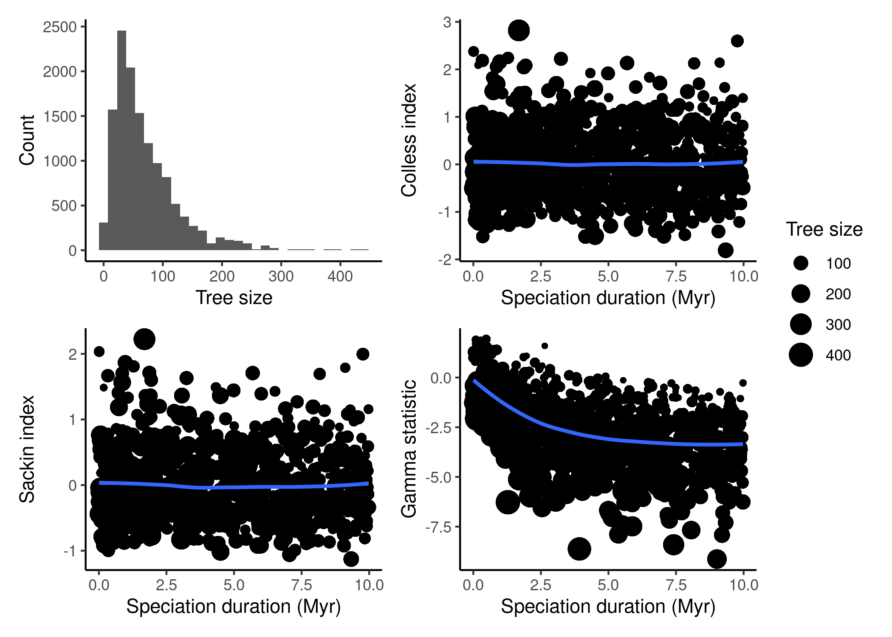

# tau

This repo contains a small study on the effect of parameter tau (the mean duration of speciation) on the statistics measured on phylogenetic trees generated by the protracted birth death model of speciation (PBD).

